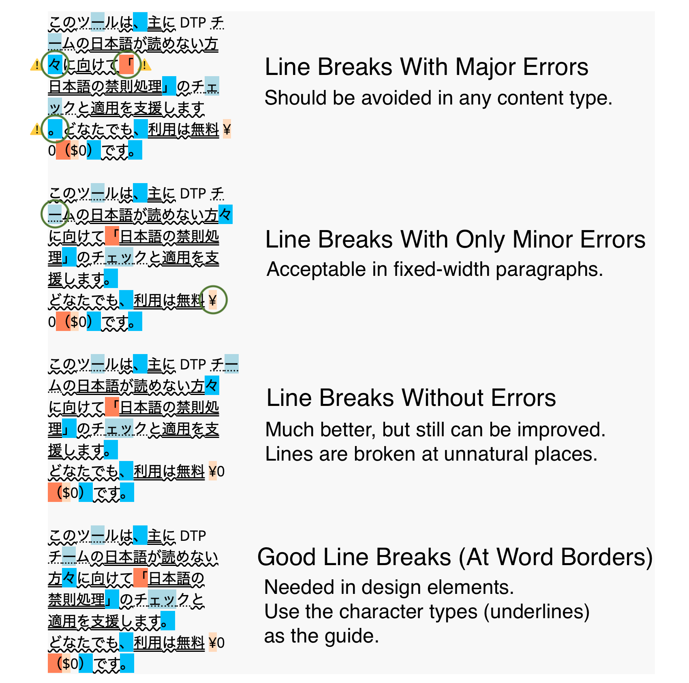

# kinsoku-checker

Visualize Japanese character types and line breaking rules

[https://shunsakurai.github.io/kinsoku-checker/](https://shunsakurai.github.io/kinsoku-checker/)

## How to use

By entering the Japanese text into the textarea input field, the tool displays the character types (hiragana, katakana, and kanji) and characters which aren't allowed at the start/end of the lines. Adjust line break positions and copy the text for your use.

## Motivation

Japanese text needs to follow line break rules ([kinsoku shori](https://en.wikipedia.org/wiki/Line_breaking_rules_in_East_Asian_languages)).

For websites, we can support the rules by simple CSS rules such as:

- `line-break: strict;`
- `overflow-wrap: break-word;`
- `word-break: keep-all;`
- `word-wrap: break-word;`

For DTPed files such as PDF and PPT, Adobe tools have settings to automatically apply the line breaking rules, but it's limited to Japanese UI. If you use the tool in other languages such as English, we need to manually check the rules.

**I created this tool to help DTP teams who don't understand Japanese language and can't use the Adobe tools in Japanese UI.**

## Japanese grammar roughly explained

Japanese sentence can be broken down to clauses and then to words. **In creative assets, the sentences look good if they are broken at clause/word borders.**

There are roughly two types of Japanese words:

**1. Independent words:**

- nouns, adjectives, verbs, adverbs, etc.
- Written with kanji, katakana, or hiragana
- Similar to content words in English

**2. Ancillary words**

- postpositional particles and auxiliary verbs
- Almost always written in hiragana
- Similar to function words in English

**Each clause starts with 1+ independent word(s) followed by 0+ ancillary word(s). That means many clauses end with hiragana.**

Example:

## License

Anyone can use this tool free of charge.

[MIT License](https://github.com/ShunSakurai/kinsoku-checker/blob/master/LICENSE)

## Privacy policy and terms of use

We don't store your data. We physically can't. (Borrowed part from [here](https://github.com/amitg87/asana-chrome-plugin/wiki/Privacy-policy).) All actions are done on client JavaScript on your computer.

I try my best to maintain the quality and safety of this extension, but please use it at your own risk. The author doesn't take any responsibility for any damage caused by use of this tool.

## Feedback and contribution

I'd love to hear from users and developers.
Please feel free to post feature requests, bug reports, and questions through the [GitHub Issues](https://github.com/ShunSakurai/kinsoku-checker/issues). I'd also welcome pull requests.