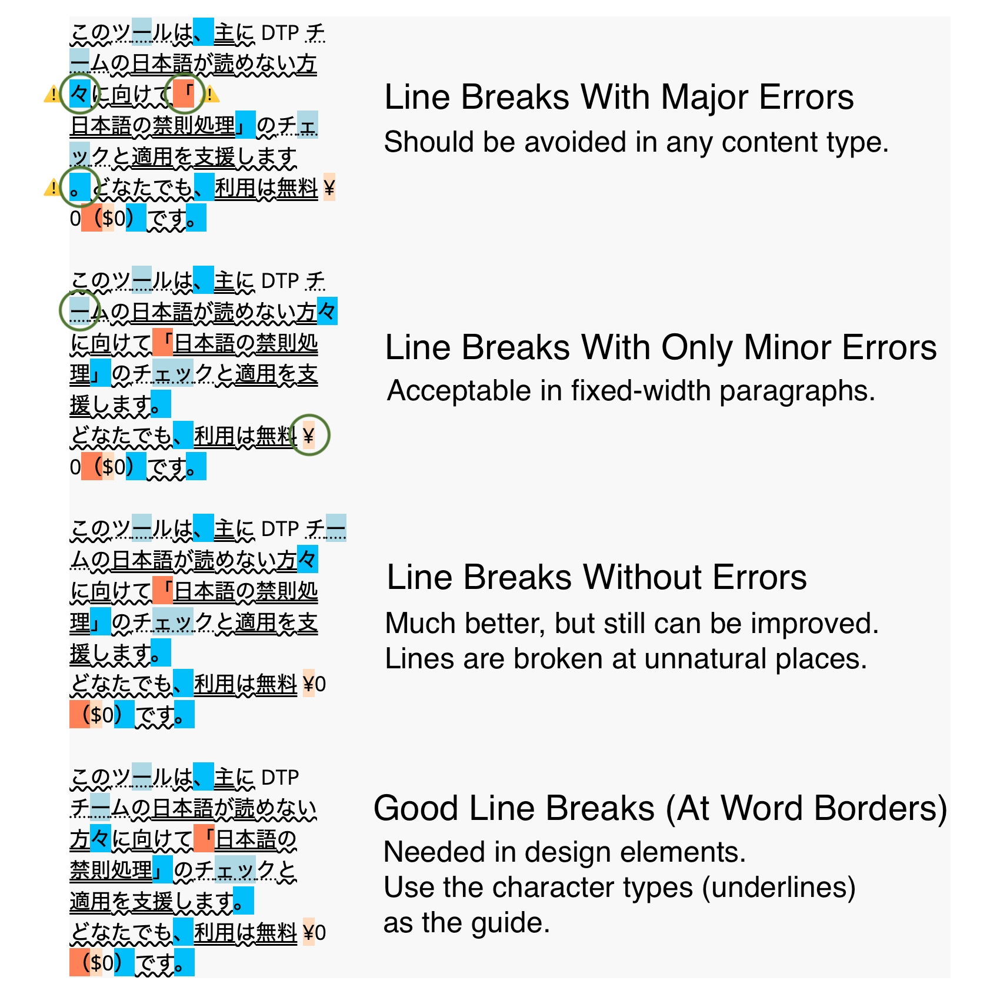

<!-- Last update on Aug 3, 2022 -->
<h2>Text input</h2>

  <textarea id="textInputArea" placeholder="Enter JA text here"></textarea>

<h2>Text display</h2>

  

<h2>Legends</h2>
<ul>
  <li>Hiragana</li>
  <li>Katakana</li>
  <li>Kanji</li>
  <li>Not allowed at the start ←</li>
  <li>Not allowed at the start (stricter rule)</li>
  <li>Not allowed at the end →</li>
  <li>Not allowed at the end (stricter rule)</li>
</ul>

<h2>Examples</h2>

  

<h2>Documentation</h2>
Please see <a href="https://github.com/ShunSakurai/kinsoku-checker" rel="noopener oreferrer" tabindex="-1" target="blank_">README</a> for details.

You might be interested in other tools by the developer:
- <a href="https://shunsakurai.github.io/trans-diff/" rel="noopener oreferrer" tabindex="-1" target="blank_">Trans Diff</a>

